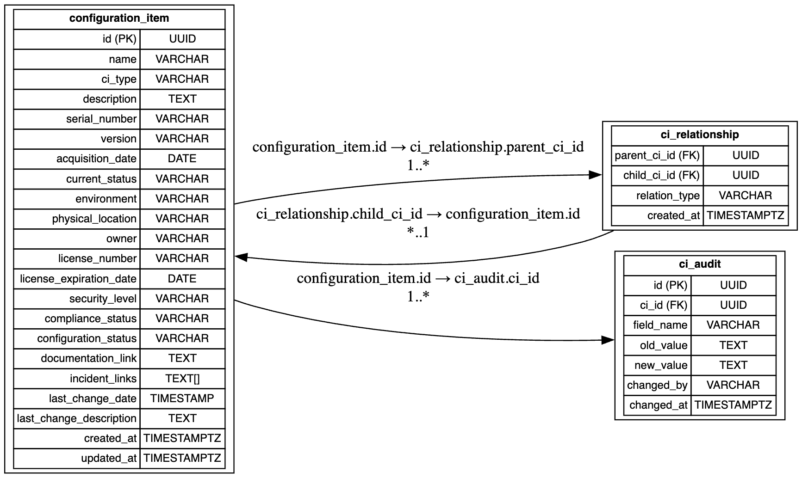

# API Express Sequelize

### Nathan Valdez - 202001568

Este proyecto es una API RESTful construida con Express y Sequelize, diseñada para gestionar elementos de configuración (Configuration Items) y sus relaciones. A continuación se detalla la estructura del proyecto y su funcionalidad.

## Estructura del Proyecto

```
api-express-sequelize
├── src
│   ├── app.js                     # Configuración de la aplicación Express
│   ├── server.js                  # Punto de entrada del servidor
│   ├── config
│   │   └── database.js            # Configuración de la conexión a la base de datos
│   ├── models
│   │   ├── ConfigurationItem.js    # Modelo de la tabla ConfigurationItem
│   │   ├── CiRelationship.js       # Modelo de la tabla CiRelationship
│   │   └── CiAudit.js              # Modelo de la tabla CiAudit
│   ├── routes
│   │   ├── index.js                # Rutas principales de la API
│   │   ├── configurationItem.routes.js # Rutas para ConfigurationItem
│   │   ├── ciRelationship.routes.js # Rutas para CiRelationship
│   │   └── ciAudit.routes.js       # Rutas para CiAudit
│   ├── controllers
│   │   ├── configurationItem.controller.js # Controlador para ConfigurationItem
│   │   ├── ciRelationship.controller.js    # Controlador para CiRelationship
│   │   └── ciAudit.controller.js           # Controlador para CiAudit
│   └── services
│       ├── configurationItem.service.js    # Servicio para ConfigurationItem
│       ├── ciRelationship.service.js       # Servicio para CiRelationship
│       └── ciAudit.service.js              # Servicio para CiAudit
├── package.json               # Configuración del proyecto para npm
└── README.md                  # Documentación del proyecto
```

## Instalación

1. Clona el repositorio:
   ```
   git clone <URL_DEL_REPOSITORIO>
   ```
   
2. Instala las dependencias:
   ```
   npm install
   ```

## Uso

1. Configura la conexión a la base de datos en `src/config/database.js`.
2. Inicia el servidor:
   ```
   npm start
   ```

3. Accede al endpoint inicial para verificar que el servidor está funcionando:
   ```
   GET http://localhost:3000/
   ```

   Deberías recibir una respuesta con el texto "Hola Mundo" y un estado 200.

---

## Funcionamiento y Flujo de la API

### 1. Flujo General

- **Cliente**: Realiza peticiones HTTP a la API (por ejemplo, crear, consultar, actualizar o eliminar elementos de configuración).
- **Rutas**: Las peticiones llegan a las rutas definidas en `src/routes/`, que determinan qué controlador debe manejar la solicitud.
- **Controladores**: Los controladores (`src/controllers/`) procesan la lógica de negocio, validan datos y llaman a los servicios.
- **Servicios**: Los servicios (`src/services/`) interactúan directamente con los modelos Sequelize para realizar operaciones en la base de datos.
- **Modelos**: Los modelos (`src/models/`) representan las tablas de la base de datos y sus relaciones.
- **Respuesta**: El resultado se envía de vuelta al cliente en formato JSON.

### 2. Endpoints Principales

- `/api/configuration-items`: CRUD de elementos de configuración.
- `/api/ci-relationships`: CRUD de relaciones entre elementos de configuración.
- `/api/ci-audits`: CRUD de auditorías de cambios sobre los elementos de configuración.

### 3. Ejemplo de Flujo

1. El cliente realiza un `POST` a `/api/configuration-items` para crear un nuevo CI.
2. La ruta redirige la petición al controlador correspondiente.
3. El controlador valida y pasa los datos al servicio.
4. El servicio utiliza el modelo `ConfigurationItem` para insertar el registro en la base de datos.
5. El resultado se devuelve al cliente.

---

## Explicaciones Técnicas

- **Express**: Framework para crear el servidor y definir rutas.
- **Sequelize**: ORM para definir modelos y relaciones, y facilitar la interacción con la base de datos.
- **CORS**: Permite que la API sea consumida desde diferentes orígenes.
- **Estructura Modular**: Separación clara entre rutas, controladores, servicios y modelos para facilitar el mantenimiento y escalabilidad.
- **Seed**: El archivo [`src/seed.js`](src/seed.js) permite cargar datos de ejemplo en la base de datos para pruebas o desarrollo.

---

## Modelo Relacional de las Tablas

A continuación se muestra el modelo relacional implementado en la base de datos:



### Relaciones

- Un **ConfigurationItem** puede tener muchos **CiAudit** (auditorías).
- Un **ConfigurationItem** puede estar relacionado con otros **ConfigurationItem** a través de **CiRelationship** (relaciones padre-hijo).
- Las relaciones entre CIs son de muchos a muchos, implementadas mediante la tabla intermedia **CiRelationship**.


### Ejemplos en base de datos

